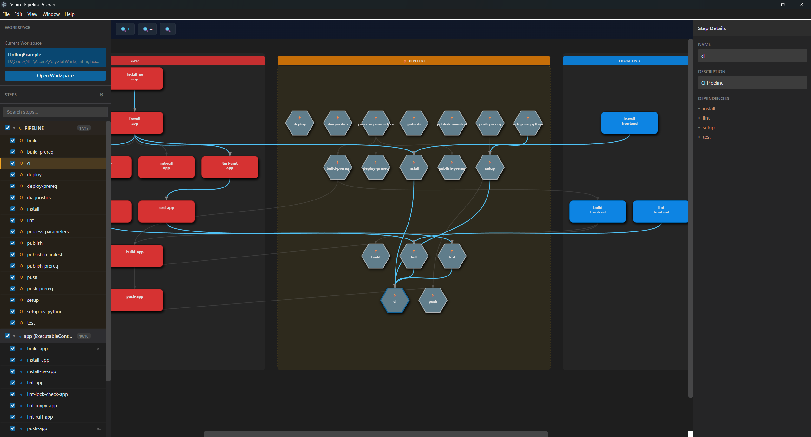

# Aspire Pipeline Viewer

[](https://github.com/tjwald/AspirePipelineViewer/actions/workflows/ci.yml)
[](https://opensource.org/licenses/MIT)

A desktop application and CLI for visualizing .NET Aspire application pipelines as interactive directed acyclic graphs (DAGs).



## Features

- 🎯 **Interactive DAG Visualization** - See your entire pipeline structure at a glance
- 📊 **Resource-Based Layout** - Steps organized by resource with automatic column grouping  
- 🔍 **Advanced Filtering** - Filter by step, resource, or tag
- ⚡ **Step Execution** - Run individual pipeline steps with real-time output (Coming soon!)
- 🎨 **Color-Coded Status** - Visual feedback for execution states (Coming soon!)
- 💻 **Cross-Platform** - Works on Windows, macOS, and Linux
- 🖥️ **CLI Support** - Parse and format pipelines from the command line

## Quick Start

```bash
# Clone the repository
git clone https://github.com/tjwald/AspirePipelineViewer.git
cd AspirePipelineViewer

# Install dependencies
pnpm install

# Start the desktop app
pnpm dev:app
```

## Installation

### Prerequisites

- Node.js 24 or higher
- pnpm 10 or higher

### From Source

```bash
git clone https://github.com/tjwald/AspirePipelineViewer.git
cd AspirePipelineViewer
pnpm install
pnpm build:all
```

## Usage

### Desktop Application

```bash
# Development mode
pnpm dev:app

# Production build
pnpm build
```

1. Click **"Select AppHost Directory"** to load your Aspire project
2. View and interact with the pipeline visualization
3. Click on steps to see details and execute them

### Command-Line Interface

```bash
# Parse diagnostics file
pnpm cli --diagnostics ./pipeline.txt --text

# Filter to specific step
pnpm cli --diagnostics ./pipeline.txt --step deploy --json

# See all options
pnpm cli --help
```

## Project Structure

```
AspirePipelineViewer/
├── src/
│   ├── core/                 # Shared parser and formatter (@aspire/core)
│   └── frontends/
│       ├── shared/           # Shared React components
│       ├── cli/              # Command-line interface
│       ├── web/              # Web frontend
│       └── electron/         # Desktop app (main + renderer)
├── tests/                    # Test suites
├── docs/                     # Documentation
└── .github/workflows/        # CI/CD configuration
```

## Documentation

- [User Guide](docs/USER_GUIDE.md) - How to use the application
- [CLI Reference](docs/CLI_DOCS.md) - Command-line options and examples
- [Developer Guide](docs/DEVELOPER_GUIDE.md) - Contributing and architecture

## Scripts

| Command | Description |
|---------|-------------|
| `pnpm dev:app` | Start Electron app in development mode |
| `pnpm build:all` | Build all packages |
| `pnpm test` | Run all tests |
| `pnpm lint` | Run ESLint |
| `pnpm format` | Format code with Prettier |
| `pnpm cli` | Run CLI |

## Technology Stack

| Component | Technology |
|-----------|------------|
| Desktop | Electron 39 |
| UI | React 19 |
| Build | Vite 5 |
| Language | TypeScript 5.7 |
| Testing | Vitest |
| Package Manager | pnpm |

## Contributing

1. Fork the repository
2. Create a feature branch (`git checkout -b feature/amazing-feature`)
3. Run tests (`pnpm test`)
4. Run linting (`pnpm lint`)
5. Commit your changes
6. Push to the branch
7. Open a Pull Request

See [Developer Guide](docs/DEVELOPER_GUIDE.md) for detailed guidelines.

## License

MIT - see [LICENSE](LICENSE) for details.

## Acknowledgments

- [.NET Aspire](https://learn.microsoft.com/dotnet/aspire/) - The framework this tool visualizes
- [Electron](https://www.electronjs.org/) - Cross-platform desktop framework
- [React](https://react.dev/) - UI library
