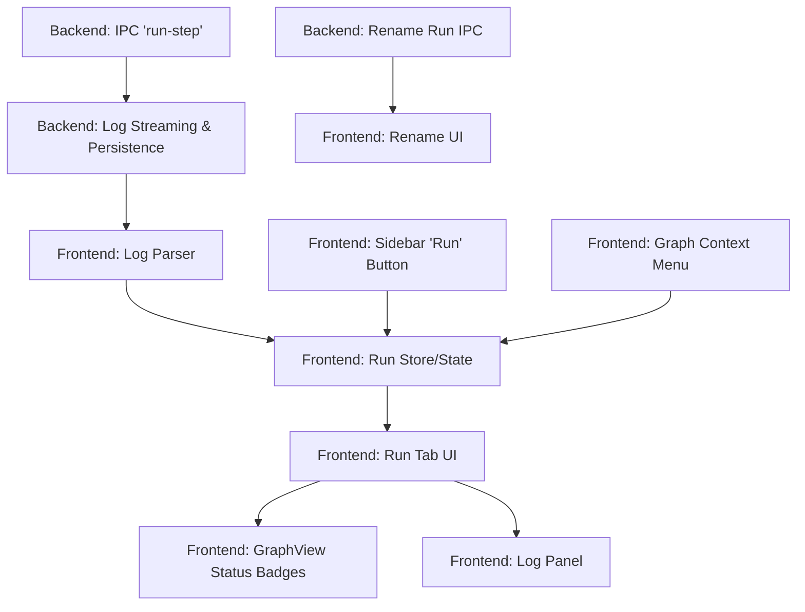

# Step Run Capability Design

## Overview
This document outlines the design and implementation plan for adding the capability to run Aspire steps directly from the Electron application. This feature allows users to execute specific steps, view live progress via a filtered dependency graph, and analyze logs in real-time.

## Goals
- Enable running a specific step (and its dependencies) from the UI.
- Visualize the execution flow in a dedicated tab.
- Display real-time status of each step (Waiting, Running, Success, Error).
- Stream and filter logs per step.
- Support reviewing historical runs.
- Persist run logs to disk and allow renaming runs.

## Non-Goals
- Modifying the `aspire` CLI itself.
- Remote execution (local only for now).
- Web interface support (Electron only).

## Architecture & Reuse

### Existing Components to Reuse
- **`GraphView`**: Will be reused to render the dependency graph in the run tab. Needs enhancement to support "status badges" on nodes.
- **Sidebar**: Will be updated to include "Run" actions.
- **IPC Bridge**: Existing `electronAPI` pattern will be extended for process execution and streaming.

### New Architecture
- **Core Package (`src/core`)**:
  - **`RunService`**: Handles spawning `aspire` processes, capturing output, and writing to log files.
  - **`LogParser`**: Parses standard `aspire` output to determine step status and route logs.
  - **`RunStore`**: Manages the state of active and past runs (metadata).
- **Electron Main (`src/frontends/electron/main.ts`)**:
  - Bridges the `RunService` to the renderer via IPC.
- **Electron Renderer (`src/frontends/electron/renderer`)**:
  - **`RunTabContainer`**: Manages the list of open runs (tabs).
  - **`RunView`**: The content of a single tab (Graph + Logs).

## UI/UX Design

### 1. Triggering a Run
- **Sidebar**: When a step is selected, a "Run Step" button appears in the details panel.
- **Context Menu**: Right-clicking a node in the main graph shows a "Run this step" option.

### 2. Run Tabs
- Clicking "Run" opens a new tab in the main view (similar to VS Code tabs).
- **Tab Header**: Shows Run Name (default: `Run <StepName> <Timestamp>`) and an overall status icon.
- **Tab Content**:
  - **Header**: Run Title (editable/renameable), Overall Status, Duration.
  - **Split View**:
    - **Left (Graph)**: A filtered `GraphView` showing only the step and its dependencies.
      - Nodes have status badges at the top-right.
      - Clicking a node filters the log view to that step; background means "All".
      - Uses the existing sidebar filters to hide/show nodes consistently.
    - **Right (Logs)**: A terminal-like log viewer.
      - Auto-scrolls on new output.
      - Supports ANSI color codes.
      - Toggle between "All logs" and "Selected step" (selection driven by graph/sidebar; no extra badges here).
      - Resizable split and an expand/collapse control to maximize logs within the tab.

### 3. Static Mock (Conceptual)
```html
<div class="run-tab">
  <header class="run-header">
    <input type="text" value="Run lint-app 10:00" />
    <span class="badge success">Succeeded</span>
    <span class="timer">8.95s</span>
  </header>
  <div class="run-content">
    <div class="graph-container">
      <!-- Reused GraphView with status overlays -->
      <div class="node" data-status="success">...</div>
    </div>
    <div class="log-panel">
      <div class="log-toolbar">
        <button class="active">All Logs</button>
        <button>lint-app</button>
      </div>
      <pre class="log-output">
09:52:13 (pipeline-execution) → Starting pipeline-execution...
...
      </pre>
    </div>
  </div>
</div>
```

## Component Design

### 1. `RunTabContainer`
- Manages the list of open runs.
- Handles tab switching.

### 2. `RunView`
- The content of a single tab.
- Holds state for: `graphData`, `nodeStatuses`, `selectedLogNode`, `logs`.

### 3. `LogViewer`
- Renders the array of log lines.
- Handles filtering based on the selected step.

### 4. `GraphNodeBadge` (Enhancement)
- A visual indicator overlay on the existing graph nodes to show status (Spinner, Checkmark, X).

## Data Models

### Run State
```typescript
interface RunSession {
  id: string;
  name: string;
  targetStep: string;
  startTime: number;
  status: 'running' | 'success' | 'failed';
  nodeStatuses: Record<string, StepStatus>; // stepName -> status
  logFilePath: string;
}

type StepStatus = 'pending' | 'running' | 'success' | 'failed' | 'skipped';
```

## Core Interface & Protocol

The `src/core` package will expose a `RunService` interface that the Electron Main process will implement/wrap.

### Interface
```typescript
interface IRunService {
  startRun(stepName: string, cwd: string): Promise<string>; // Returns runId
  stopRun(runId: string): Promise<void>;
  renameRun(runId: string, newName: string): Promise<void>;
  getRunHistory(): Promise<RunSession[]>;
}
```

### Streaming Protocol (IPC)
The Core/Main process will emit events to the UI.

- `run-output`: `{ runId: string, line: string, stepName?: string, timestamp: number }`
  - `stepName` is parsed by the Core `LogParser` before sending to UI.
- `run-status-change`: `{ runId: string, status: RunStatus, nodeStatuses: Record<string, StepStatus> }`
  - The Core `LogParser` maintains the state of node statuses and emits updates.

### Detailed Log Flow
1.  **Process Execution (Core)**: `RunService` spawns `aspire do <step>` and captures `stdout`/`stderr`.
2.  **Parsing (Core)**: `LogParser` processes each line to extract `stepName`, `timestamp`, and detect status changes.
3.  **IPC Transmission (Main)**: Main process listens to `RunService` events and forwards them to the renderer via `webContents.send('run-output', payload)`.
4.  **Bridge (Preload)**: `preload.ts` exposes `onRunOutput` to the renderer.
5.  **State Update (Renderer)**: `RunStore` receives the event, appends the line to the master log, and also to the specific step's log buffer if `stepName` is present.
6.  **Rendering**: `LogViewer` displays lines from the selected step's buffer or the master log.

## IPC & Backend

### Main Process
- **`run-step`**: Accepts `stepName`, `cwd`. Spawns `aspire do <stepName>`.
- **`kill-run`**: Terminates the process.
- **`rename-run`**: Renames the associated log file.
- **Log Persistence**: Streams stdout/stderr to a file in a temp/runs directory.

### IPC Channels
- `on('run-output', (runId, line) => void)`
- `on('run-status-change', (runId, status) => void)`

## Log Parsing & Status Mapping

We will parse the `aspire` output to update the graph state.

### Regex Patterns
Based on the provided example:

1.  **Start Step**: `^\d{2}:\d{2}:\d{2}\s+\(([^)]+)\)\s+→\s+Starting`
    - Capture group 1: Step Name.
    - Action: Set node status to `running`.

2.  **Step Success**: `^\d{2}:\d{2}:\d{2}\s+\(([^)]+)\)\s+✓\s+.*completed successfully`
    - Capture group 1: Step Name.
    - Action: Set node status to `success`.

3.  **Step Failure**: `^\d{2}:\d{2}:\d{2}\s+\(([^)]+)\)\s+✗\s+.*` (General failure line)
    - *Note*: We might need to detect the final failure summary or infer failure if the process exits non-zero and the step didn't complete.
    - Looking at the log: `(install-uv-app) ✗ [ERR] ...` indicates the output was in stderr which is common for many tools outputing intermideate outputs of the command. It doesn't indecate an error. 
    - Reliable failure: If the process exits with error, or we see a specific "failed" message.
    - *Refinement*: The summary at the end `✓ 7/7 steps succeeded` is the ultimate source of truth for the pipeline, but for individual steps, we track the `✓ ... completed successfully` line.

4.  **Log Routing**: `^\d{2}:\d{2}:\d{2}\s+\(([^)]+)\)\s+.*`
    - Capture group 1: Step Name.
    - Action: Append line to the specific step's log buffer AND the "All" log buffer.

### Example Parsing
Input: `09:52:13 (install-uv-app) → Starting install-uv-app...`
- Match: Start Step
- Step: `install-uv-app`
- Status: `running`

Input: `09:52:14 (install-uv-app) ✓ install-uv-app completed successfully`
- Match: Step Success
- Step: `install-uv-app`
- Status: `success`

## Persistence
- Runs are stored as JSON metadata + text log files in `userData/runs/`.
- On app launch, we can reload history (optional for V1, but good for "renaming" requirement).
- Renaming a run updates the metadata file.

## Testing Strategy
1.  **Unit Tests**:
    - `LogParser`: Feed it the example output lines and assert state changes.
    - `RunManager`: Test creating, renaming, and closing runs.
2.  **Component Tests**:
    - `RunView`: Mock the graph and logs, ensure split view works.
3.  **E2E Tests**:
    - Trigger a run from sidebar.
    - Verify tab opens.
    - Verify graph updates (mocked backend output).
    - Verify logs appear.

## Task Dependency Graph



## Implementation Phases

This section rewrites the implementation phases into independent, testable steps, each with explicit validation and subagent instructions. All technical details from the original plan are preserved.

### Phase 1: Static UI Mock
- **Status:** Complete.
- **Goal:** Create a static HTML/CSS mock of the Run Tab UI for review.
- **Location:** [`src/frontends/electron/renderer/mock-run.html`]
- **Tasks:**
  - Create a static HTML file with tab strip, run header, split pane (graph placeholder + log panel).
  - Style with existing theme variables.
  - Mock the "Running" state with badges and log output.
- **Validation:**
  - Run `pnpm lint` to ensure code style.
  - No logic to unit test; visual review only.
  - Run `pnpm --filter @aspire-pipeline-viewer/electron test:e2e` to ensure no regressions.
- **Subagent Instructions:**
  1. Implement the static mock as described (verify `src/frontends/electron/renderer/mock-run.html` exists).
  2. Run the validation commands above.
  3. Commit only if all checks pass.

### Phase 2: Core Logic (Parsing & Streaming)
- **Goal:** Implement backend logic for running steps and parsing logs.
- **Location:** [`src/core/services/runService.ts`], [`src/core/services/logParser.ts`]
- **Tasks:**
  - Implement `LogParser` with regexes and comprehensive unit tests.
  - Implement `RunService` to spawn processes and pipe output through parser.
  - Define and export `IRunService` interface.
  - Ensure `LogParser` is purely functional and testable (no Node APIs required).
  - Provide a mockable `RunService` that can be replaced in tests with a simulated process emitter.
- **Validation:**
  - Run `pnpm lint` and `pnpm test:unit` (must cover all new logic).
  - Ensure all new functionality is unit testable; aim for >80% coverage for new modules.
- **Subagent Instructions:**
  1. Implement `LogParser` with unit tests covering start/success/failure/log-routing patterns.
  2. Implement `RunService` Node implementation under `src/frontends/electron/services/runService.ts` that implements `IRunService` and emits parsed events; keep core abstractions in `src/core`.
  3. Provide a test-double `MockRunService` for unit tests.
  4. Run `pnpm lint` and `pnpm test:unit`.
  5. Commit only if all checks pass.

### Phase 3: Electron Main & IPC
- **Goal:** Expose core functionality to Renderer via IPC.
- **Location:** [`src/frontends/electron/main.ts`], [`src/frontends/electron/preload.ts`]
- **Tasks:**
  - Implement `ipcMain` handlers for `run-step`, `kill-run`, `rename-run`.
  - Set up streaming from `RunService` to `webContents.send` and forward `run-status-change` events.
  - Update `electronAPI` type definition in `preload.ts`.
  - Ensure the main process uses the Electron-specific `RunService` implementation from the Electron package.
- **Validation:**
  - Run `pnpm lint`, `pnpm test:unit`, and `pnpm --filter @aspire-pipeline-viewer/electron test:e2e`.
  - Add unit tests that mock `RunService` and assert IPC handlers forward events correctly.
- **Subagent Instructions:**
  1. Implement IPC handlers and event forwarding.
  2. Add/extend unit tests for IPC (mock `RunService`).
  3. Run the validation commands above.
  4. Commit only if all checks pass.

### Phase 4: UI Components (Renderer)
- **Goal:** Implement the Run Tab UI components.
- **Location:** [`src/frontends/electron/renderer/components/RunTab/`]
- **Tasks:**
  - Create `RunTabContainer` and `RunView` components.
  - Implement `LogViewer` component with scroll/ansi support and filtering.
  - Update `GraphView` (or wrap it) to accept `nodeStatuses` and render `GraphNodeBadge` overlays.
  - Integrate with `window.electronAPI` to start runs and subscribe to `run-output` and `run-status-change` events.
  - Persist run metadata updates (rename) via IPC.
- **Validation:**
  - Run `pnpm lint`, `pnpm test:unit`, and `pnpm --filter @aspire-pipeline-viewer/electron test:e2e`.
  - Unit-test UI logic where possible (hooks, stores, parser consumers); create only a few E2E tests to validate tab opening, log streaming, and per-node filtering.
- **Subagent Instructions:**
  1. Implement components and unit tests for component logic (use RTL / vitest as in project).
  2. Add minimal E2E tests that simulate `RunService` events and verify renderer updates.
  3. Run the validation commands above.
  4. Commit only if all checks pass.

### Phase 5: Integration & UX Polish
- **Goal:** Connect triggers and finalize UX.
- **Location:** [`src/frontends/electron/renderer/Sidebar.tsx`], [`src/frontends/shared/components/GraphView.tsx`]
- **Tasks:**
  - Add "Run" button to Sidebar details and hook to open Run tab.
  - Add Context Menu to Graph nodes to start runs.
  - Implement Rename UI that calls IPC `rename-run` and updates local store.
  - Ensure features are gated for Electron only (web frontend must not expose run flows).
- **Validation:**
  - Run `pnpm lint`, `pnpm test:unit`, and `pnpm --filter @aspire-pipeline-viewer/electron test:e2e`.
  - Extend unit and E2E tests for the integrated flows.
- **Subagent Instructions:**
  1. Implement integration tasks and unit tests.
  2. Add E2E tests for context menu and sidebar trigger flows.
  3. Run the validation commands above.
  4. Commit only if all checks pass.

### Phase 6: Interactive CLI Input (Deferred)
- **Goal:** Support Aspire CLI prompts by piping stdin from the renderer.
- **Location:** [`src/core/services/runService.ts`], [`src/frontends/electron/main.ts`], [`src/frontends/electron/preload.ts`], renderer run UI.
- **Tasks:**
  - Detect prompt/output patterns that require input.
  - Add IPC channel for sending user responses from UI to the running process stdin.
  - Provide a minimal prompt UI in the run tab.
  - Preserve non-interactive default behavior when no prompts are present.
- **Validation:**
  - Run `pnpm lint`, `pnpm test:unit`, and `pnpm --filter @aspire-pipeline-viewer/electron test:e2e`.
  - Add/extend unit and E2E tests for prompt flows.
- **Subagent Instructions:**
  1. Implement CLI input support as described.
  2. Add/extend tests for prompt handling.
  3. Run the validation commands above.
  4. Commit only if all checks pass.

---

Based on the design, here is the exact flow of log data from the executed command to the UI:

### 1. Process Execution (Core / Main Process)
*   **Component**: `RunService` (in `src/core/services/runService.ts`)
*   **Action**: Uses Node.js `spawn` to execute `aspire do <step>`.
*   **Capture**: Listens to the `stdout` and `stderr` streams of the child process.

### 2. Parsing & Enrichment (Core)
*   **Component**: `LogParser` (in `src/core/services/logParser.ts`)
*   **Action**: As each line of text is received, it is passed to the parser.
*   **Logic**: The parser uses regex to extract metadata from the line (e.g., `09:52:13 (pipeline-execution) → ...`).
    *   **Step Name**: Extracted from the parentheses `(pipeline-execution)`.
    *   **Timestamp**: Extracted from the start of the line.
    *   **Status**: Checks if the line indicates a step starting or finishing.

### 3. IPC Transmission (Main -> Renderer)
*   **Component**: Electron Main (main.ts)
*   **Action**: The Main process subscribes to events from `RunService` and forwards them to the specific window via `webContents.send`.
*   **Channel**: `run-output`
*   **Payload**:
```typescript
{
  runId: "run-123",
  line: "09:52:13 (pipeline-execution) → Starting pipeline-execution...",
  stepName: "pipeline-execution", // Parsed by Core
  timestamp: 1703584333000
}
```

### 4. Bridge (Preload)
*   **Component**: `preload.ts`
*   **Action**: Exposes a safe listener for the renderer.
```typescript
// preload.ts
onRunOutput: (callback) => ipcRenderer.on('run-output', (_event, data) => callback(data))
```

### 5. State Update & Rendering (Renderer)
*   **Component**: `RunStore` / `RunView`
*   **Action**:
  1.  Receives the event via `window.electronAPI.onRunOutput`.
  2.  Appends the line to the **Master Log** (all output).
  3.  If `stepName` is present, appends the line to that **Step's Log Buffer**.
*   **UI**: The `LogViewer` component observes these arrays. If the user has selected "pipeline-execution", it renders from that specific buffer; otherwise, it renders the Master Log.
